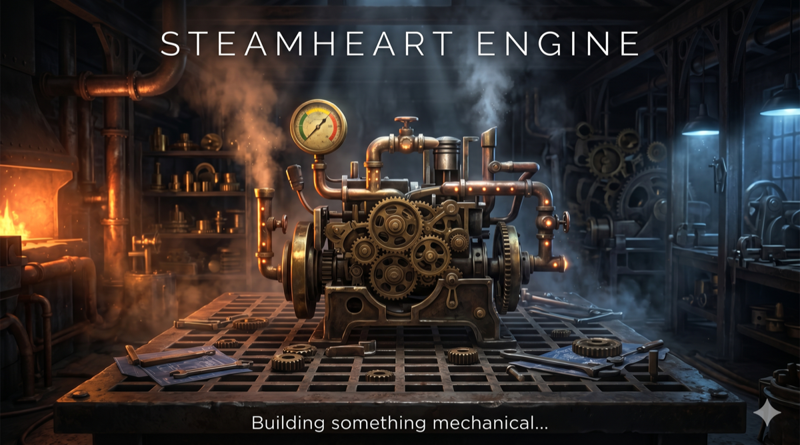

# Steamheart Engine

> *A steampunk machine-building puzzle game*

**[▶ Play on itch.io](https://skazoff.itch.io/steamheart-engine)** · **Gamedev.js Jam 2026** · Theme: *Machines*

---

## About

**Steamheart Engine** is a grid-based puzzle game where you assemble working steam-powered machines from gears, axles, and corner pieces. Parts arrive from a queue — place them, rotate them, connect the power source to the target, then activate. If the chain is valid, the machine roars to life.

20 handcrafted levels of escalating complexity across a single training chapter. The real machines are still being built.

---

## Gameplay

| Mechanic | Description |
|---|---|
| **Gear** | Connects all 4 sides. Place anywhere, rotation irrelevant. |
| **Axle** | Connects 2 opposite sides only. Rotate to switch horizontal ↔ vertical. |
| **Corner** | Connects 2 adjacent sides in an L-shape. 4 rotations — placement matters. |
| **Pressure** | Some levels have a rising steam gauge. Run out of time and the boiler blows. |
| **Discard** | Early levels give you a few discard tokens to skip unwanted parts. |
| **Undo** | Made a mistake? Press U to take back the last placement. |

### Controls

```
Click        — place current part
R            — rotate part
Space        — activate machine  /  next level after win
U            — undo last placement
D            — discard current part (limited tokens)
ESC / M      — main menu
```

---

## Screenshots

<!-- Add screenshots here after deployment -->

---

## Tech Stack

| Tool | Version | Role |
|---|---|---|
| [Phaser 3](https://phaser.io/) | 3.80.1 | Game framework |
| [TypeScript](https://www.typescriptlang.org/) | 5.4.5 | Language |
| [Vite](https://vitejs.dev/) | 5.2.0 | Build tool |

Static browser bundle — no server, no plugins. Runs on desktop and mobile browsers.

### Architecture

```
src/
├── main.ts                  # Phaser config, scene registry
├── scenes/
│   ├── BootScene.ts         # Immediate passthrough
│   ├── PreloadScene.ts      # Asset loading with progress bar
│   ├── MainMenuScene.ts     # Title screen
│   ├── LevelSelectScene.ts  # Level grid with unlock/progress
│   ├── GameScene.ts         # Core gameplay
│   ├── CreditsScene.ts      # Credits screen
│   └── EndScene.ts          # Chapter complete screen
├── objects/
│   └── Grid.ts              # Grid data model + renderer
├── systems/
│   └── validateChain.ts     # BFS chain validation
├── data/
│   └── levels.ts            # All 20 level definitions
└── types/
    └── index.ts             # Shared types
```

### Running Locally

```bash
npm install
npm run dev       # dev server at localhost:5173
npm run build     # production build → /dist
npm run preview   # serve /dist locally
```

---

## Credits

### Game

**Steamheart Engine** — created by **Max Basev** for Gamedev.js Jam 2026 (theme: *Machines*).

Solo developer — design, code, level design, direction.

### Code & Frameworks

| Library | Version | License |
|---|---|---|
| [Phaser 3](https://phaser.io/) | 3.80.1 | MIT |
| [TypeScript](https://www.typescriptlang.org/) | 5.4.5 | Apache 2.0 |
| [Vite](https://vitejs.dev/) | 5.2.0 | MIT |

### Art

All sprites and visual assets — gear parts, floor tiles, axles, corners, backgrounds, pressure bar, UI elements — were created by **Max Basev** using **Google Gemini** image generation.

Generated output is owned by the creator per the tool's terms of service.

### Audio

All audio was created by **Max Basev** using AI music and audio generation tools.

| File | Description | Tool |
|---|---|---|
| `Pressure_and_Pinions.mp3` | Background music | Google Gemini |
| `Gear-Installed.mp3` | Part placement sound effect | Suno AI |
| `Rotating-Gears.mp3` | Machine activation sound effect | Suno AI |

### Font

UI and HUD text rendered using Phaser's built-in monospace font rendering — no external font files required.

---

## Jam Compliance

- ✅ Runs in browser with no plugins
- ✅ Theme: *Machines* — the entire game is about building and activating machines
- ✅ Built from scratch for this jam
- ✅ All assets created during / for the jam
- ✅ English as default language
- ✅ Mobile-friendly (touch controls, landscape enforced)

---

*Gamedev.js Jam 2026 · Solo entry · 13 days*
